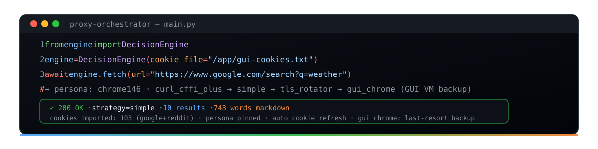

<p align="center">
  
</p>

<p align="center">
  <strong>Proxify — Universal Anti-Bot Bypass Gateway &amp; Web Fetcher Toolkit</strong><br>
  Fetch any site — Google, Reddit, Cloudflare-protected, JS-heavy SPAs — as clean, LLM-ready markdown.
</p>

<p align="center">
  <a href="https://www.python.org/downloads/"></a>
  <a href="https://fastapi.tiangolo.com/"></a>
  <a href="https://github.com/topics/docker"></a>
  <a href="https://docs.python.org/3/library/asyncio.html"></a>
  
  
  
  
</p>

---

## 🚀 What is this?

**Proxify** is a production-grade gateway that gets you the *real* content from hard-to-scrape sites. It routes every request through an **11-tier adaptive strategy pipeline** — from cheap TLS-fingerprint-impersonating HTTP clients (curl_cffi) up to a persistent **headful GUI Chrome in a virtual display (Xvfb) VM** — automatically escalating past anti-bot walls: Cloudflare, reCAPTCHA, Reddit's JS proof-of-work, Google's `sorry` blocks, and more.

The killer feature: **bake your real browser session cookies into the system**. Export cookies from your own browser once (`proxy-orchestrator/scripts/brave_cookies.py`), drop the file in, and every strategy (including plain HTTP!) sends your trusted session — Google and Reddit stop serving captchas to the container.

**Every response comes back as clean markdown** for LLM-friendly consumption — the `/fetch` API returns `html` *and* `markdown` + metadata.

---

## ✨ Features

| Feature | Description |
|---------|-------------|
| 🧠 **11-tier adaptive pipeline** | curl_cffi_plus → simple → drissionpage_plus → nodriver → tls_rotator → scrapling → flaresolverr → playwright → puppeteer → puppeteer_plus → **gui_chrome** (GUI VM, last resort) |
| 🍪 **Real session cookies** | Import your browser's cookies (Netscape format) → sent by *every* strategy (including the Lib++ jar), auto-refreshed on a timer AND injected into the GUI profile |
| 🖥️ **GUI VM browser strategy** | Persistent headful Chrome (Xvfb + CDP :9222) with real cookies/cache — the strongest trust signal — used only when cheap strategies fail |
| 🎭 **One stealth persona** | `PERSONA_PINNED=true` → every path (HTTP + GUI Chrome) presents the SAME Chrome 146 identity: same TLS, UA, Accept-Language, Sec-CH-UA. No more "same cookies from 9 browsers" alerts |
| 🛡️ **TLS fingerprint impersonation** | 40+ JA3/JA4 profiles (Chrome/Safari/Firefox/Edge), per-domain learning, browser-family fallback |
| 🔍 **Google SERP extraction** | Real `h3` result parsing → clean linked markdown (10 results, snippets, titles) |
| 🆔 **Agent-friendly API** | `use_browser: true` / `browser: "gui_chrome"` knobs so AI agents can force a real browser |
| 📡 **All HTTP methods** | `GET`, `POST`, `PUT`, `DELETE`, `PATCH`, `HEAD`, `OPTIONS` — supported on all 11 strategy tiers including GUI Chrome |
| ♻️ **Cookie refresh** | `POST /cookies/refresh` + background loop — sessions stay warm without restarts |
| 📦 **42-type captcha bridge** | ai-captcha-bypass integration (reCAPTCHA, hCaptcha, Turnstile, GeeTest…) |
| 🔄 **Multi-layer cache** | L1 RAM + L2 Redis, request dedup, circuit breakers, rate limiting |
| 📡 **Proxy + WebSocket + REST** | HTTP CONNECT tunnel (8888), FastAPI REST (8080), streaming WS |

---

## 📁 Project Structure

```
proxify/                          # repo root
├── README.md                     # this file
├── BUG_POWER.md                  # full bug audit & reverse-engineering notes
├── docs/                         # banner.svg + guides (API, architecture, deploy, SDK)
├── proxy-orchestrator/           # the gateway (builds the Docker image)
│   ├── gateway/                  # REST (FastAPI), WebSocket, MITM proxy
│   ├── engine/                   # Decision Engine, anti-bot, quality, captcha bridge
│   ├── strategies/               # simple, playwright, puppeteer, gui_chrome, …
│   ├── services/                 # cookie jar, cache, rate limiter, sessions, metrics
│   ├── scripts/
│   │   ├── brave_cookies.py      # 🍪 Export real cookies from Brave → Netscape file
│   │   ├── gui_browser.sh        # 🖥️ Launch persistent headful Chrome (Xvfb + CDP)
│   │   └── test_*.py             # Diagnostic suites
│   ├── config.py                 # All settings via env vars
│   ├── main.py                   # Entry point
│   └── docker-compose.yml        # orchestrator + redis + flaresolverr
└── Lib++/                        # next-gen strategy layer (pip-installed as Lib_plus_plus)
    ├── strategies/               # curl_cffi_plus, nodriver, tls_rotator, …
    ├── adapters/                 # LibPlusAdapter, DomainTrackerPlus
    ├── processors/               # dom_to_markdown, clean_dom
    ├── core/                     # TLS profiles, session cookie sharing
    └── setup.py                  # package metadata
```

All paths in this README are relative to `proxify/` (the repo root).

---

## 🏗️ Strategy Pipeline (11-Tier Escalation)

| # | Strategy | Technique | Best For |
|---|----------|-----------|----------|
| 1 | **curl_cffi_plus** | curl_cffi TLS impersonation + browser-family fallback chain | Fastest; old.reddit, most sites |
| 2 | **simple** | curl_cffi TLS fingerprint, dual UA phases for Google | High-perf, no-JS pages |
| 3 | **drissionpage_plus** | Hybrid SessionPage + ChromiumPage | Cookie-required pages |
| 4 | **nodriver** | CDP-direct (no WebDriver leaks) | JS-heavy SPAs, Turnstile |
| 5 | **tls_rotator** | Full TLS rotation, per-domain learning | Rate-limited targets |
| 6 | **scrapling** | Stealthy Firefox-based scraper | General scraping |
| 7 | **flaresolverr** | Cloudflare "Under Attack" solver | Cloudflare challenges |
| 8 | **playwright** | Full Chromium automation | Complex SPAs |
| 9 | **puppeteer** | Node.js subprocess | Last-resort JS |
| 10 | **puppeteer_plus** | Bundled inline script + proxy | Extreme cases |
| 11 | **gui_chrome** | **Persistent headful Chrome in Xvfb VM** (CDP :9222) | 💀 The final backup — real desktop browser with persistent cookies/cache |

> **Why GUI Chrome is last:** launching a real desktop browser (Xvfb + persistent profile) is computationally expensive. The pipeline first tries cheap HTTP/TLS strategies — and thanks to the cookie import, those usually win. Only when everything else fails does the GUI VM get used.

> **All HTTP methods on all tiers:** every strategy supports `GET`, `POST`, `PUT`, `DELETE`, `PATCH`, `HEAD`, and `OPTIONS`. Configure allowed methods via `ALLOWED_METHODS` env var (default: all).

---

## 🍪 Real Session Cookies (Stealth Core)

The system works best when it carries **your real browser identity**. Google/Reddit serve captchas to strangers — they serve content to a known session.

### 1. Export cookies from your browser

```bash
# Brave (Linux snap) — auto-detects your profile:
python3 proxy-orchestrator/scripts/brave_cookies.py extract \
    --profile ~/snap/brave/current/.config/BraveSoftware/Brave-Browser \
    --out /tmp/brave_cookies_netscape.txt

# Chrome / Chromium / Edge:
python3 proxy-orchestrator/scripts/brave_cookies.py extract --profile ~/.config/google-chrome

# Default --wanted=google,reddit,yandex. Export ALL sites:
python3 proxy-orchestrator/scripts/brave_cookies.py extract --all \
    --out /tmp/brave_cookies_netscape.txt
```

> 🔒 **How it works (reverse-engineered, documented in BUG_POWER.md SF-14):**
> Brave 1.93 encrypts its cookie DB with Chromium's `PosixKeyProvider` — `v10 + salt(16) + IV(16) + AES-128-CBC`, key `PBKDF2-SHA1("peanuts","saltysalt")` — a **hardcoded public constant** in Chromium. No keyring access needed. The script handles it automatically.

### 2. Drop the file into the system

```bash
docker cp /tmp/brave_cookies_netscape.txt po-test:/app/gui-cookies.txt
docker exec po-test curl -X POST localhost:8080/cookies/refresh
```

The orchestrator loads it at startup **and** on every refresh interval (`COOKIE_REFRESH_INTERVAL`, default 30 min). The cookies flow into:
- **HTTP strategies** (`simple`, `curl_cffi_plus`) → sent as `Cookie:` headers
- **Lib++ cross-strategy jar** → lazy-pulled from the central jar so nodriver/drissionpage/tls_rotator get them too
- **GUI Chrome** → injected into the persistent profile on refresh + on boot (`gui_browser.sh` re-injects whenever the file is newer than the last injection)

### Auto cookie refresh

- **Background loop** — re-imports the cookie file whenever it changes on disk (mtime watch, `COOKIE_REFRESH_INTERVAL`)
- **GUI sync** — every refresh also pushes the fresh cookies into the GUI Chrome profile so both paths stay identical
- **API** — `POST /cookies/refresh` for on-demand hot-reload (returns `gui_chrome_injected`)

### API

| Endpoint | Method | Description |
|----------|--------|-------------|
| `/cookies/status` | GET | Domains, counts, source file, last refresh |
| `/cookies/refresh` | POST | Re-import cookie file + re-inject into GUI Chrome (no restart) |

### What you get (measured, in-container, persona pinned)

```
POST /cookies/refresh → {"imported":1541, "gui_chrome_injected":true, "domains":448, "total_cookies":1541}

Google search via gui_chrome:      1.0s  200  848 words  real SERP  no /sorry   ua=Chrome/146 + ch=146 + win
old.reddit via gui_chrome:         2.0s  200  1265 words real posts  no challenge
old.reddit via curl_cffi_plus:     1.5s  200  1186 words real posts  no challenge  tls=chrome146
Yandex search via gui_chrome:      0.9s  200  429 words  real SERP + AI summary  no captcha
Yandex search via drissionpage_+   2.1s  200  268 words  real SERP  no captcha
GitHub trending via curl_cffi_+:   0.9s  200  67 words   real list  no challenge
```

> **Cookie coverage (since Aug 2026):** the extractor no longer defaults to
> `google,reddit` only — the default `--wanted` is `google,reddit,yandex` and
> `--all` exports **every** domain from the real browser profile (measured:
> 1,584 cookies / 451 domains from Brave). Yandex was captcha'ing the browser
> path ~50% of the time because the profile had no `yandexuid`/`yp`/`_yasc`
> cookies (it looked like incognito — no history/cookies). After import,
> Yandex serves real SERPs with zero captchas.

> **Domain-scoped cookie matching:** the CookieManager matches cookies by
> request-domain + parent suffixes only (`_matching_keys` in
> `services/cookie_jar.py`), so `www.google.com` requests receive only
> `.google.com`/`accounts.google.com` cookies — never `facebook.com`,
> `youtube.com` or `yandex.com` ones. Measured overlap between
> google∩reddit∩yandex∩facebook cookie names: **none**. A single global
> 448-domain jar is safe because each request only ever sees its own domain's
> cookies.

> **Why this matters:** before persona pinning, the HTTP path rotated TLS families (chrome/safari/firefox/edge) with random UAs and random Accept-Language per request while the GUI Chrome presented a different fixed identity. Google's risk engine correlates fingerprints — the same IP + the same real cookies appearing as 9 different browsers is exactly what triggers `sorry` on BOTH paths. Pinning everything to one Chrome 146 persona (and launching the GUI Chrome with `--user-agent` = persona UA) makes every request look like the same user's browser. The GUI Chrome additionally overrides the full UA *and* client-hint metadata via CDP (`Emulation.setUserAgentOverride`) so `Sec-CH-UA` / `Sec-CH-UA-Platform` can never contradict the spoofed UA string — a real Chromium 149-on-Linux binary presenting `Chrome/146 + "Windows" + v="146"` end-to-end.

---

## 🖥️ GUI Chrome VM Strategy

`gui_chrome` is a real, **non-headless** Chrome running in a virtual display inside the container:

- **Xvfb** on `:99` (1920×1080) — a real display server
- **Persistent profile** at `/app/gui-profile` — cookies, cache, localStorage, history accumulate like a real user's
- **CDP** on `:9222` — the strategy attaches over CDP (never launches its own browser)
- **Anti-fingerprint init script** — hides webdriver, spoofs WebGL/plugins, masks WebRTC IPs

Launch it (auto-starts with `main.py` when Xvfb is present):

```bash
bash proxy-orchestrator/scripts/gui_browser.sh   # inside the container
# or set GUI_CHROME_ENABLED=false to disable
```

---

## 📊 Stress-Test Benchmark (measured, in-container, full cookie jar)

Run the bundled suite (`proxy-orchestrator/scripts/stress_test.py`, args: `per-domain  concurrency  per-request-timeout`):

```bash
docker exec po-test python3 /app/scripts/stress_test.py 8 4 15
```

### Results (Aug 2026, full 448-domain / 1,541-cookie jar, persona pinned)

| Site | Concurrency | Success | Content | Fast-path latency | Winner strategy |
|------|-------------|---------|---------|-------------------|-----------------|
| **GitHub** trending | 4 | **6/6 (100%)** | 67 words real list | 0.5–1.9s | `curl_cffi_plus` |
| **Reddit** old.reddit | 4 | **6/6 (100%)** | 1,186–1,265 words real posts | 1.5s | `curl_cffi_plus` / `simple` |
| **Yandex** search | 4 | **6/6 (100%)** | 268–429 words real SERP + AI | 0.5–2.2s | `drissionpage_plus` / `gui_chrome` |
| **Google** search | serial | **4/4 (100%)** | 820–848 words real SERP | 0.9–1.6s | `gui_chrome` |

### Notes

- **Google is rate-limited by our OWN guardrail, not by Google** — after ~2 rapid hits the domain circuit-breaker throttles for 30s (`PER_DOMAIN_RATE_LIMIT=10/s` + 429 circuit). This is intentional protection, not a block. Serial use stays 100% and fast.
- **Before the Yandex cookie import** Yandex served `showcaptcha` on ~50% of browser requests (profile looked like incognito — no `yandexuid`/`yp`). After import: **zero captchas**.
- **Before the GUI Chrome client-hint fix** Google served `/sorry/` to the browser path because `Sec-CH-UA` reported `v="149"`/`"Linux"` while the UA string claimed `Chrome/146`/Windows — a contradiction Google's risk engine reads as "fooled". Now the browser presents `Chrome/146 + v="146" + "Windows"` end-to-end.
- Slow outliers (e.g. Reddit at 15.7s) are pipeline escalation — a fast strategy was skipped by RIL or the shared client pool needed a reset (`SimpleStrategy timeout → stale pool guard`), not site blocks.

---

## 🤖 Agent-Friendly Fetch API

`POST http://localhost:8080/fetch` — returns `{html, markdown, markdown_metadata, strategy_used, ...}`.

```json
{
  "url": "https://www.google.com/search?q=weather+in+dhaka",
  "use_browser": true,
  "timeout": 50
}
```

| Field | Type | Effect |
|-------|------|--------|
| `url` | string | **required** — target URL |
| `method` | string | Any HTTP method — `GET` (default), `POST`, `PUT`, `DELETE`, `PATCH`, `HEAD`, `OPTIONS` — works on all 11 strategy tiers including GUI Chrome |
| `headers` | object | extra request headers |
| `body` | string | request body (for POST) |
| `timeout` | number | per-request timeout (default 30s) |
| `bypass_cache` | bool | skip L1/L2 cache |
| `use_browser` | bool | force a **real browser** (gui_chrome → playwright → puppeteer) |
| `browser` | string | force an exact strategy: `gui_chrome`, `playwright`, `nodriver`, `simple`, … |
| `force_strategy` | string | alias of `browser` |
| `session_id` | string | sticky session (UA/cookies) |

```bash
curl -s -X POST localhost:8080/fetch \
  -H 'Content-Type: application/json' \
  -d '{"url":"https://old.reddit.com/r/Python/","timeout":60}' \
  | jq '{success, status_code, strategy_used, words: .markdown_metadata.word_count, md: (.markdown[0:120])}'
```

---

## ⚡ Quick Start

### Docker (recommended)

Run from the repo root (`proxify/`). The compose context is the repo root, so the image
includes both `proxy-orchestrator/` and `Lib++/`:

```bash
docker compose -f proxy-orchestrator/docker-compose.yml up -d --build orchestrator
# Proxy: http://localhost:8888
# REST:   http://localhost:8080
# GUI VM: Xvfb :99 + Chrome CDP :9222 (auto)
```

### Native

Lib++ is a separate pip package that the engine auto-detects at `Lib++/` (repo root).
To install it as an editable package:

```bash
cd proxy-orchestrator
python -m venv .venv && source .venv/bin/activate
pip install -r requirements.txt
pip install -e ../Lib++
python main.py
```

### Test it

```bash
# Health
curl -s localhost:8080/health

# Fetch Google → markdown
curl -s -X POST localhost:8080/fetch \
  -H 'Content-Type: application/json' \
  -d '{"url":"https://www.google.com/search?q=python+asyncio"}'

# Use a browser explicitly
curl -s -X POST localhost:8080/fetch \
  -H 'Content-Type: application/json' \
  -d '{"url":"https://example.com","use_browser":true}'

# Cookie status
curl -s localhost:8080/cookies/status
```

---

## 🔌 Configuration (env vars)

All settings live in `proxy-orchestrator/config.py` (a Pydantic `Settings` class).
`load_dotenv()` is called at import, so you can configure three ways:

1. **`.env` file** — drop a `.env` next to `config.py` (`proxy-orchestrator/.env`) with `KEY=value` lines. It's gitignored.
2. **Shell environment** — export variables before starting (`PROXY_PORT=9000 python main.py`).
3. **docker-compose** — pass them under `environment:` on the `orchestrator` service.

`.env` is gitignored (see `proxify/.gitignore`) so secrets and cookie paths never get committed.

| Variable | Default | Description |
|----------|---------|-------------|
| `PROXY_PORT` | `8888` | HTTP CONNECT proxy port |
| `API_PORT` | `8080` | REST/WS API port |
| `STRATEGY_ORDER` | 11-tier chain | Comma-separated strategy priority |
| `COOKIE_FILE` | `/app/gui-cookies.txt` | Netscape cookie file (real sessions) |
| `COOKIE_REFRESH_INTERVAL` | `1800` | Re-check cookie file every N seconds (30 min) |
| `GUI_CHROME_ENABLED` | `true` | Auto-start GUI Chrome VM |
| `PERSONA_PINNED` | `true` | Pin ALL strategies to ONE fingerprint (stealth). `false` = legacy rotation |
| `PERSONA_TLS` | `chrome146` | curl_cffi impersonate target for the persona |
| `PERSONA_UA` | Chrome/146 Win | The single UA presented by every path (incl. GUI Chrome) |
| `PERSONA_ACCEPT_LANGUAGE` | `en-US,en;q=0.9` | Fixed locale — a real user doesn't change it per request |
| `PERSONA_SEC_CH_UA` | Chromium/146 | Client-hint brand matching the persona |
| `PERSONA_PLATFORM` | `"Windows"` | Platform hint matching the persona UA |
| `PERSONA_VIEWPORT` | `1920` | Fixed viewport width |
| `CURL_CFFI_IMPERSONATE` | chrome+safari+edge+firefox | TLS fingerprint rotation targets (used when `PERSONA_PINNED=false`) |
| `REDIS_URL` | `redis://localhost:6379/0` | L2 cache |
| `FLARESOLVERR_URL` | `http://localhost:8191/v1` | Cloudflare solver |
| `GLOBAL_RATE_LIMIT` | `100` | req/s |
| `PER_DOMAIN_RATE_LIMIT` | `10` | per-domain req/s |
| `LOG_LEVEL` | `INFO` | logging verbosity |
| `ALLOWED_METHODS` | `GET,POST,PUT,DELETE,PATCH,HEAD,OPTIONS` | Comma-separated HTTP methods allowed across all strategies. Strategies not listed here fall back to GET-only. |

---

## 📊 API Endpoints

| Endpoint | Method | Description |
|----------|--------|-------------|
| `/fetch` | POST | Universal fetch → html + markdown |
| `/health` | GET | Health + registered strategies |
| `/metrics` | GET | Prometheus metrics |
| `/stats` | GET | Engine stats (per-domain, strategies) |
| `/stats/cache` | GET | L1/L2 cache stats |
| `/stats/proxies` | GET | Upstream proxy health |
| `/stats/circuits` | GET | Circuit breaker states |
| `/cookies/status` | GET | Imported cookie jar status |
| `/cookies/refresh` | POST | Hot-reload cookie file |
| `/captcha/status` | GET | ai-captcha-bypass connectivity |
| `/captcha/solve` | POST | Solve 42 captcha types / VM agent |
| `/config` | POST | Runtime strategy order updates |
| `/ws/fetch` | WebSocket | Streaming fetch |

---

## 🛠️ Troubleshooting

| Symptom | Fix |
|---------|-----|
| Google returns `/sorry/` on the browser path | The GUI Chrome's client hints contradicted its UA (real Chromium 149/Linux vs spoofed Chrome/146/Windows). Fix applied via CDP `Emulation.setUserAgentOverride` (see above). Also check the tunnel MTU (below) — a lossy VPN interface makes every browser request fragment/drop and Google soft-blocks with `/sorry/` even when fingerprints are perfect. |
| Google `429 Rate limited` under load | Our own per-domain rate limiter + 30s throttle circuit (protection, not a Google block). Space requests out or raise `PER_DOMAIN_RATE_LIMIT`. |
| Reddit `www` thin/empty | Known server-side throttling of this IP; `old.reddit` is the reliable target (verified working, incl. gui_chrome). |
| Yandex shows captcha | The profile lacked Yandex cookies (looked like incognito). Re-extract with `--all` (or default `--wanted` now includes `yandex`) so `yandexuid`/`yp`/`_yasc` are injected. |
| Cookies not injected | Check the file is Netscape format, path matches `COOKIE_FILE`, then `POST /cookies/refresh`. |
| GUI Chrome not starting | Needs `Xvfb` inside the container; check `/tmp/gui_chrome.log`. |
| Playwright "not available" | Self-healing browser installer runs automatically; or `python -m playwright install chromium`. |

> ### ⚠️ Tunnel / VPN MTU tuning (packet-loss based)
>
> When routing container egress through a wireguard/OpenVPN tunnel (e.g. the
> `homecloud` Bangladesh tunnel), **do not assume a fixed MTU** — tune it by
> *measured packet loss*. A too-high interface MTU fragments packets on the
> remote path, and TCP connections silently drop. This looks like a site
> block and re-broke Google with `/sorry/` on **every** browser path even
> though the fingerprints, headers and cookies were all correct.
>
> Diagnose it with `ping` over the tunnel (payload = MTU `- 28`):
>
> ```bash
> # link overhead is IP(20) + ICMP(8) = 28 bytes. Loss means fragmenting.
> ping -c 10 -M do -s 1352 8.8.8.8   # = MTU 1380 → 40% loss (BAD)
> ping -c 10 -M do -s 1252 8.8.8.8   # = MTU 1280 → 0%  loss (GOOD)
> ping -c 10 -M do -s 1172 8.8.8.8   # = MTU 1200 → 0%  loss (GOOD)
> ```
>
> Set the interface MTU to the largest size with 0% loss:
>
> ```bash
> ip link set dev homecloud mtu 1280
> # Click together with: ip route add default dev homecloud
> ```
>
> Symptoms when MTU is too high: raw `curl` intermittently times out
> (`000`) but returns 200 on clean connections; a real browser (which opens
> ~6 parallel TLS connections) consistently gets a soft-block such as
> Google `/sorry/` while plain curl to the same IP succeeds. **Rule of thumb:
> if a tunnel causes mysterious site blocks `curl` doesn't, lower the MTU
> until `ping -M do` shows 0% packet loss.**

---

## 📚 Docs & References

- [`BUG_POWER.md`](BUG_POWER.md) — full bug audit + every reverse-engineering session (TLS fingerprints, cookie crypto, Docker fingerprinting)
- [`docs/banner.svg`](docs/banner.svg) — repo banner
- [`docs/API_AND_PROXY.md`](docs/API_AND_PROXY.md) — REST/WS API + proxy reference
- [`docs/ARCHITECTURE.md`](docs/ARCHITECTURE.md) — pipeline & strategy docs


---

## 🙏 Credits

Built as part of the Furylogic search stack. Uses [curl_cffi](https://github.com/lexiforest/curl_cffi), [Playwright](https://playwright.dev), [FastAPI](https://fastapi.tiangolo.com), [httpx](https://www.python-httpx.org).

## 📄 License

MIT
